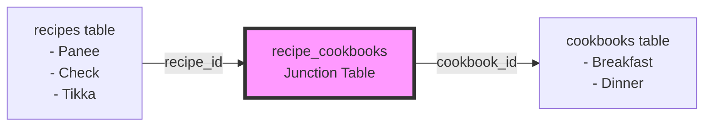

# How Recipes Connect to Cookbooks

## The Many-to-Many Relationship

Your database uses a **junction table** pattern to connect recipes to cookbooks. This is a standard database design that allows:
- One recipe to belong to multiple cookbooks
- One cookbook to contain multiple recipes

## The Three Tables

### 1. `recipes` Table
Stores the actual recipe data:
- `id` - Unique ID for each recipe
- `title` - Recipe name (e.g., "Panee", "Tikka")
- `household_id` - Which household owns this recipe
- `servings`, `prep_time_minutes`, etc.

### 2. `cookbooks` Table  
Stores cookbook information:
- `id` - Unique ID for each cookbook
- `name` - Cookbook name (e.g., "Breakfast", "Dinner")
- `household_id` - Which household owns this cookbook

### 3. `recipe_cookbooks` Table (Junction Table)
This is the **connector** between recipes and cookbooks:
- `recipe_id` - Points to a recipe
- `cookbook_id` - Points to a cookbook

## Example from Your Database

Looking at your screenshot, here's what's happening:

```
recipe_cookbooks table:
┌─────────────────────────────────────┬─────────────────────────────────────┐
│ recipe_id                           │ cookbook_id                         │
├─────────────────────────────────────┼─────────────────────────────────────┤
│ 0c0f9964-aecc-4fb2-b56d-7f2bb2c2    │ f6c6350f-6466-41bc-9fac-470458c49961│ <- Recipe "Panee" in "Breakfast"
│ 1fd0cb04-0b54-403d-a718f1ad06d6     │ f6c6350f-6466-41bc-9fac-470458c49961│ <- Recipe "Check" in "Breakfast" 
│ 21b2d3a-xxxxx-4790-bd3b-7f043f7b0d5 │ f6c6350f-6466-41bc-9fac-470458c49961│ <- Recipe "Xx" in "Breakfast"
└─────────────────────────────────────┴─────────────────────────────────────┘
```

## How to Read This

1. **Find a cookbook** (e.g., "Breakfast" with ID `f6c6350f...`)
2. **Look in `recipe_cookbooks`** for all rows where `cookbook_id` = `f6c6350f...`
3. **For each match**, get the `recipe_id` and look it up in the `recipes` table

This gives you all recipes in that cookbook!

## Visual Diagram



## Why "0 Recipes" Shows Up

The app counts recipes by:
1. Querying `recipe_cookbooks` for entries matching the cookbook ID
2. Counting how many `recipe_id` values are returned

If you see "0 Recipes" but recipes exist in the cookbook screen, it means:
- ✅ The junction table HAS the links (that's why you see recipes inside)
- ❌ The counting query on the home page is broken or using wrong data

This is what we'll fix next!
